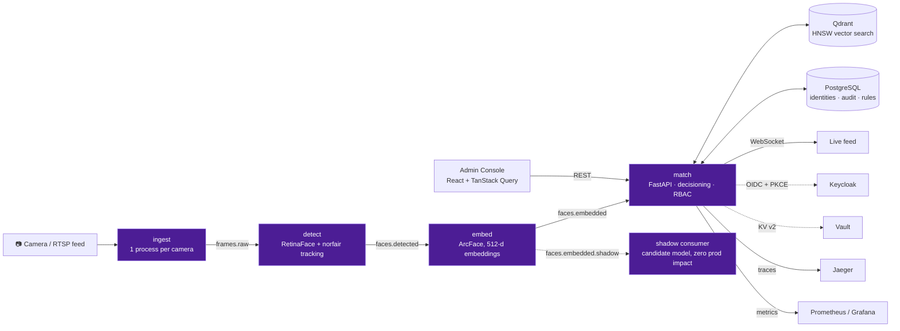

<div align="center">


# BLACK ICE

**A production-grade, real-time face-recognition access control platform** —
event-driven pipeline, vector search, real IdP, HA/DR, and a trained
anti-spoofing model, verified against **real infrastructure**, not mocks.

[Русская версия](README.ru.md) · [Architecture](#architecture) · [Features](#features) · [Quick Start](#quick-start) · [Tests](#testing)


</div>

---

## What is this

BLACK ICE is a face-recognition-based access control system, built the way a
real production system would be: a Kafka-streamed detection→embedding→match
pipeline instead of a monolith, a real vector database for similarity
search, a real identity provider instead of hardcoded keys, real backup/
restore for stateful services, and a trained anti-spoofing model instead of
a heuristic placeholder.

The defining constraint of this project: **every non-trivial claim in this
README is backed by a real run against real infrastructure** — real
Postgres (not SQLite), a real Qdrant server (not embedded mode), a real
Keycloak instance, a real LFW dataset for calibration. That discipline
surfaced actual bugs that mocks would have hidden — a few are called out
below, because catching them *was* the point of testing this way.

## Architecture



Four independently-scalable services communicate over Kafka (Redpanda),
each a separate deployable unit with its own Docker image, its own
Kubernetes `Deployment` + `HorizontalPodAutoscaler`, and its own Prometheus
metrics endpoint. `ingest` is one process **per camera** (video decode is
CPU-bound and doesn't parallelize under the GIL — the scaling unit is the
process, not a thread).

## Features

Everything below is implemented and tested against real infrastructure —
not a roadmap.

<table>
<tr><td width="50%" valign="top">

**Recognition pipeline**
- Kafka-streamed detect → embed → match, horizontally scalable per stage
- ArcFace embeddings (insightface/buffalo_l), Qdrant HNSW search
- Frame sampling + [Norfair](https://github.com/tryolabs/norfair) tracking — avoids re-embedding a static face every frame
- Open-set recognition — below threshold is always `UNKNOWN`, never "close enough"
- FAR/FRR/EER calibration on **real LFW** (1,149 photos, 96 identities) — EER threshold 0.116, production default 0.45 validated as a deliberate low-FAR bias

**Security**
- Real IdP: Keycloak OIDC + PKCE (`keycloak-js`), alongside API-key auth — pick per environment
- Trained anti-spoofing (MiniFASNetV2, ONNX) — not a placeholder, see [below](#a-real-anti-spoofing-model-with-a-real-bug-caught-by-testing)
- Template protection — orthogonal-transform "cancelable biometrics" for stored embeddings, revocable by rotating a seed
- RBAC (admin / operator / viewer / ingest) backed by a real Postgres table, not an env-var parsed per request
- Secrets in HashiCorp Vault (KV v2), opt-in, zero footprint when unset

</td><td width="50%" valign="top">

**Operations**
- Zero-downtime Qdrant re-index via alias-swap (change HNSW params, rebuild, swap, no downtime)
- Shadow-mode model deployment — evaluate a candidate model against live traffic with zero production impact
- Drift monitoring (KS-test) on an hourly CronJob, pushed via Pushgateway
- Real backup/restore for Postgres (`pg_dump`/`pg_restore`) and Qdrant (snapshot + alias-swap), on a K8s CronJob
- Distributed tracing across the Kafka hop — manual W3C `traceparent` propagation so one frame's trip through 4 services is one Jaeger trace

**Access control**
- Rule engine: identity × camera × weekday × time window (overnight windows included), fail-closed by default
- Webhook alerting on `access_denied` / `camera_offline`, decoupled from infra alerts
- Dynamic ingest orchestration — registering a camera can actually deploy its ingest process (Docker or Kubernetes backend)
- Admin console (React 19, TanStack Query) — cameras, identities, access rules, alert rules, live audit log

</td></tr>
</table>

### A real anti-spoofing model, with a real bug caught by testing

The liveness check ships with [MiniFASNetV2](https://github.com/minivision-ai/Silent-Face-Anti-Spoofing)
converted to ONNX (SHA-256 verified against the documented conversion), not
a heuristic stand-in. While wiring it up, **two independent documentation
sources disagreed** on which of its 3 output classes means "live" (index 0
vs. index 1) — both turned out to be wrong. Running it against 6 real faces
showed a consistent index **2** carrying ~99% of the softmax mass. That's
the kind of bug you only catch by testing against real data instead of
trusting a README — which is exactly the standard this project holds
itself to.

### The "test with real infrastructure" discipline, in practice

Three real bugs, invisible to SQLite/mocks, caught during this project:

- `DELETE /identities/{id}` raised a `ForeignKeyViolation` on real Postgres
  whenever the identity had audit history — SQLite doesn't enforce foreign
  keys by default, so every prior test passed. Fixed with `ON DELETE SET
  NULL` + explicit FK enforcement on SQLite test connections too, so the
  bug class can't hide again.
- A too-tight crop between the detect and embed stages quietly degraded
  alignment — only visible once embeddings were compared against a real
  gallery, not a synthetic one.
- `match`'s background Kafka consumer treated `UNKNOWN_TOPIC_OR_PART` as
  fatal and never retried — invisible in tests (topics always exist by the
  time a test subscribes), but guaranteed on a real cold start, where a
  consumer can subscribe before any producer has created the topic it's
  waiting on. Fixed by treating it as transient, the same way an end-of-
  partition signal already was.

## 🛠 Tech Stack

| Layer | Technology |
|---|---|
| **Pipeline services** | Python 3.11 · FastAPI · confluent-kafka · OpenTelemetry |
| **Computer vision** | insightface (ArcFace) · ONNX Runtime · OpenCV · Norfair tracking |
| **Vector search** | Qdrant (HNSW, alias-based zero-downtime reindex) |
| **Relational store** | PostgreSQL 17 · SQLAlchemy 2.0 |
| **Streaming** | Redpanda (Kafka-protocol compatible) |
| **Identity** | Keycloak (OIDC + PKCE) · HashiCorp Vault (KV v2) |
| **Frontend** | React 19 · TypeScript · Vite · TanStack Query · Radix UI · Tailwind v4 · keycloak-js |
| **Infra** | Docker Compose (dev) · Kubernetes + Helm (prod) · HPA autoscaling |
| **Observability** | Prometheus · Grafana · Jaeger · Pushgateway |
| **CI** | GitHub Actions — lint, 121 tests, image builds, `helm lint`/`template` + `kubeconform` |

## Quick Start

```bash
git clone https://github.com/deuteriumZzz/black_ice.git
cd black_ice

# core pipeline + admin console (Postgres, Qdrant, Redpanda, all 4 services, admin-ui)
docker compose -f infra/docker-compose.yml up -d

# optional: observability stack (Prometheus, Grafana, Jaeger, Pushgateway)
docker compose -f infra/docker-compose.yml --profile observability up -d

# optional: real Keycloak (see "Real IdP" below) / real Vault
docker compose -f infra/docker-compose.yml --profile idp up -d keycloak
docker compose -f infra/docker-compose.yml --profile secrets up -d vault
```

- Admin console: http://localhost:5174 (`dev-admin-key` / `dev-operator-key`)
- Match API docs: http://localhost:8000/docs
- Live terminal-style demo UI: http://localhost:8080
- Grafana: http://localhost:3000 · Jaeger: http://localhost:16686

```bash
curl -F "name=Neo" -F "consent=true" -F "file=@face.jpg" \
  -H "X-API-Key: dev-admin-key" http://localhost:8000/enroll

curl -F "file=@face.jpg" \
  -H "X-API-Key: dev-operator-key" http://localhost:8000/identify
```

## Testing

```bash
pip install -r services/match/requirements.txt  # + ruff, pytest
python -m pytest tests/unit tests/integration -q   # 121 passed
```

Integration tests run against real ONNX models and a real Postgres/Qdrant-
compatible surface (SQLite + in-memory Qdrant for CI speed, with foreign-
key enforcement explicitly turned on to catch the class of bug SQLite
normally hides) — not pure mocks. A separate load test (`tests/load/`,
Locust) and a full LFW-based calibration script (`ml/eval/`) exercise real
external data. The full first-run verification log against real
Postgres/Qdrant/Locust — including a live-Kafka Docker Desktop debugging
saga — is in [docs/VERIFICATION.md](docs/VERIFICATION.md).

## 📁 Project Structure

```
services/          detect · embed · match · ingest — one Dockerfile each
libs/black_ice_common/   shared: db, rbac, oidc, vectorstore, liveness,
                          template_protection, alerting, secrets, tracing...
admin-ui/          React operator console (identities, cameras, rules, audit)
ui/                lightweight terminal-style live demo
infra/             docker-compose.yml · Kubernetes/Helm chart · Keycloak realm
ml/                calibration scripts (FAR/FRR/EER) · bundled ONNX weights
observability/     Prometheus alert rules, Grafana dashboards
scripts/           backup/restore, reindex, drift monitoring, ops tooling
tests/             unit · integration · load (Locust)
```

## 🔐 Real IdP (Keycloak)

`AUTH_BACKEND=oidc` switches every protected endpoint from a static
`X-API-Key` to a validated Bearer JWT against a real Keycloak realm — role
comes straight from `realm_access.roles`. The admin console switches its
login form for a genuine Authorization Code + PKCE flow via `keycloak-js`.
Verified end to end, not just at the code level: a real browser login
through a real Keycloak instance, session surviving a page reload via
silent SSO, and role-gated API calls all confirmed live.

```bash
docker compose -f infra/docker-compose.yml --profile idp up -d keycloak
# .env: AUTH_BACKEND=oidc, OIDC_ISSUER_URL=http://localhost:8180/realms/black-ice
```

## ☸️ Deployment

The Helm chart (`infra/k8s/black-ice/`) deliberately does **not** bundle
stateful infrastructure (Kafka, Qdrant, Postgres) — that coupling is what
makes upgrades and backups painful. It ships Deployments + HPAs for the
four pipeline services, a CronJob-based backup/retention/drift-monitoring
suite, and opt-in Vault/OIDC/dynamic-orchestration integration, all gated
behind `values.yaml` flags so the default install stays simple.

```bash
helm lint infra/k8s/black-ice
helm template infra/k8s/black-ice | kubeconform -strict -summary
```

## License

MIT — see [LICENSE](LICENSE).
