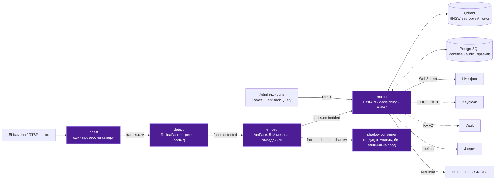

<div align="center">


# BLACK ICE

**Продакшен-уровня система контроля доступа по распознаванию лиц в реальном
времени** — событийный пайплайн, векторный поиск, настоящий IdP, HA/DR и
обученная антиспуфинг-модель, всё проверено на реальной инфраструктуре, не на моках.

[English version](README.md) · [Архитектура](#архитектура) · [Возможности](#возможности) · [Быстрый старт](#быстрый-старт) · [Тесты](#тесты)


</div>

---

## Что это

BLACK ICE — система контроля доступа по распознаванию лиц, построенная так,
как строилась бы настоящая продакшен-система: пайплайн
детекция→эмбеддинг→матчинг на Kafka вместо монолита, настоящая векторная БД
для поиска по сходству, настоящий identity-провайдер вместо захардкоженных
ключей, настоящий backup/restore для stateful-сервисов и обученная
антиспуфинг-модель вместо эвристической заглушки.

Главное правило проекта: **каждое нетривиальное утверждение в этом README
подтверждено реальным прогоном против реальной инфраструктуры** — реальный
Postgres (не SQLite), реальный сервер Qdrant (не embedded-режим), реальный
Keycloak, реальный датасет LFW для калибровки. Именно эта дисциплина
вскрыла настоящие баги, которые моки бы просто не заметили — часть из них
описана ниже, потому что поймать их — и была вся суть такого подхода к
тестированию.

## Архитектура



Четыре независимо масштабируемых сервиса общаются через Kafka (Redpanda),
каждый — отдельный деплоймент со своим Docker-образом, своим
Kubernetes `Deployment` + `HorizontalPodAutoscaler` и своим Prometheus-эндпоинтом
метрик. `ingest` — один процесс **на камеру** (декодирование видео
CPU-bound и не параллелится под GIL — единица масштабирования это процесс,
не поток).

## Возможности

Всё ниже — реализовано и протестировано против реальной инфраструктуры, не
роадмап на будущее.

<table>
<tr><td width="50%" valign="top">

**Пайплайн распознавания**
- Kafka detect→embed→match, горизонтально масштабируется на каждом этапе
- ArcFace-эмбеддинги (insightface/buffalo_l), поиск по Qdrant HNSW
- Frame sampling + трекинг [Norfair](https://github.com/tryolabs/norfair) — не переэмбеддит статичное лицо на каждом кадре
- Open-set recognition — ниже порога всегда `UNKNOWN`, никогда "похоже на"
- Калибровка FAR/FRR/EER на **реальном LFW** (1149 фото, 96 личностей) — EER-порог 0.116, продакшен-дефолт 0.45 подтверждён как осознанный сдвиг в сторону меньшего FAR

**Безопасность**
- Настоящий IdP: Keycloak OIDC + PKCE (`keycloak-js`), наравне со статичными API-ключами — выбирается под окружение
- Обученный антиспуфинг (MiniFASNetV2, ONNX) — не заглушка, см. [ниже](#настоящая-антиспуфинг-модель-с-настоящим-багом-найденным-тестированием)
- Template protection — "cancelable biometrics" через ортогональное преобразование эмбеддинга, отзываемо ротацией seed
- RBAC (admin / operator / viewer / ingest) на реальной таблице Postgres, не парсинг env var на каждый запрос
- Секреты в HashiCorp Vault (KV v2), опционально, нулевой след, если не настроено

</td><td width="50%" valign="top">

**Эксплуатация**
- Zero-downtime переиндексация Qdrant через alias-swap (сменить параметры HNSW, пересобрать, переключить — без даунтайма)
- Shadow-mode деплой моделей — оценка модели-кандидата на живом трафике без влияния на прод
- Drift monitoring (KS-тест) почасовым CronJob'ом, метрики через Pushgateway
- Настоящий backup/restore для Postgres (`pg_dump`/`pg_restore`) и Qdrant (снапшот + alias-swap), на K8s CronJob
- Распределённый трейсинг через Kafka-хоп — ручная передача W3C `traceparent`, весь путь кадра через 4 сервиса виден как один трейс в Jaeger

**Контроль доступа**
- Движок правил: identity × камера × день недели × временное окно (включая окна через полночь), fail-closed по умолчанию
- Webhook-алертинг на `access_denied` / `camera_offline`, отдельно от инфра-алертов
- Динамическая оркестрация ingest — регистрация камеры может реально развернуть её ingest-процесс (Docker или Kubernetes)
- Admin-консоль (React 19, TanStack Query) — камеры, личности, правила доступа, алерт-правила, live audit log

</td></tr>
</table>

### Настоящая антиспуфинг-модель с настоящим багом, найденным тестированием

Проверка живости использует [MiniFASNetV2](https://github.com/minivision-ai/Silent-Face-Anti-Spoofing),
сконвертированную в ONNX (SHA-256 сверен с задокументированной конвертацией),
а не эвристическую заглушку. При подключении модели **два независимых
источника документации разошлись** в том, какой из 3 классов выхода — "живое
лицо" (индекс 0 или индекс 1) — оба оказались неверны. Прогон на 6 реальных
лицах показал устойчивый индекс **2** (~99% softmax-массы). Такой баг можно
поймать только тестированием на реальных данных, а не доверием к README —
именно этому стандарту проект следует сам к себе.

### Дисциплина "тестируй на реальной инфраструктуре" на практике

Три реальных бага, невидимых для SQLite/моков, пойманы в ходе разработки:

- `DELETE /identities/{id}` падал с `ForeignKeyViolation` на реальном
  Postgres при наличии audit-истории у identity — SQLite по умолчанию не
  проверяет внешние ключи, поэтому все предыдущие тесты проходили. Исправлено
  через `ON DELETE SET NULL` + явное включение FK enforcement и на SQLite в
  тестах тоже, чтобы этот класс багов больше не мог спрятаться.
- Слишком узкий crop между стадиями detect и embed незаметно портил
  alignment — проявилось только при сравнении эмбеддингов с реальной
  галереей, не синтетической.
- Фоновый Kafka-консьюмер в `match` считал `UNKNOWN_TOPIC_OR_PART` фатальной
  ошибкой и не переподключался — незаметно в тестах (топики там уже
  существуют к моменту подписки), но гарантированно на реальном холодном
  старте, где консьюмер может подписаться раньше, чем хоть один продюсер
  создал топик, который он ждёт. Исправлено — теперь это транзиентная
  ситуация, как и сигнал конца партиции, обрабатываемый рядом.

## 🛠 Технологический стек

| Слой | Технологии |
|---|---|
| **Сервисы пайплайна** | Python 3.11 · FastAPI · confluent-kafka · OpenTelemetry |
| **Компьютерное зрение** | insightface (ArcFace) · ONNX Runtime · OpenCV · трекинг Norfair |
| **Векторный поиск** | Qdrant (HNSW, zero-downtime reindex через alias) |
| **Реляционное хранилище** | PostgreSQL 17 · SQLAlchemy 2.0 |
| **Стриминг** | Redpanda (совместим с протоколом Kafka) |
| **Identity** | Keycloak (OIDC + PKCE) · HashiCorp Vault (KV v2) |
| **Frontend** | React 19 · TypeScript · Vite · TanStack Query · Radix UI · Tailwind v4 · keycloak-js |
| **Инфраструктура** | Docker Compose (dev) · Kubernetes + Helm (прод) · автоскейлинг HPA |
| **Observability** | Prometheus · Grafana · Jaeger · Pushgateway |
| **CI** | GitHub Actions — lint, 121 теста, сборка образов, `helm lint`/`template` + `kubeconform` |

## Быстрый старт

```bash
git clone https://github.com/deuteriumZzz/black_ice.git
cd black_ice

# основной пайплайн + admin-консоль (Postgres, Qdrant, Redpanda, все 4 сервиса, admin-ui)
docker compose -f infra/docker-compose.yml up -d

# опционально: стек наблюдаемости (Prometheus, Grafana, Jaeger, Pushgateway)
docker compose -f infra/docker-compose.yml --profile observability up -d

# опционально: реальный Keycloak (см. "Реальный IdP" ниже) / реальный Vault
docker compose -f infra/docker-compose.yml --profile idp up -d keycloak
docker compose -f infra/docker-compose.yml --profile secrets up -d vault
```

- Admin-консоль: http://localhost:5174 (`dev-admin-key` / `dev-operator-key`)
- Документация Match API: http://localhost:8000/docs
- Live-демо в терминальном стиле: http://localhost:8080
- Grafana: http://localhost:3000 · Jaeger: http://localhost:16686

```bash
curl -F "name=Neo" -F "consent=true" -F "file=@face.jpg" \
  -H "X-API-Key: dev-admin-key" http://localhost:8000/enroll

curl -F "file=@face.jpg" \
  -H "X-API-Key: dev-operator-key" http://localhost:8000/identify
```

## Тесты

```bash
pip install -r services/match/requirements.txt  # + ruff, pytest
python -m pytest tests/unit tests/integration -q   # 121 passed
```

Интеграционные тесты прогоняются против реальных ONNX-моделей и
Postgres/Qdrant-совместимой поверхности (SQLite + in-memory Qdrant ради
скорости CI, с явно включённым enforcement внешних ключей, чтобы ловить
именно тот класс багов, который SQLite обычно прячет) — не чистые моки.
Отдельный нагрузочный тест (`tests/load/`, Locust) и полный скрипт
калибровки на LFW (`ml/eval/`) работают с настоящими внешними данными.
Полный лог первого прогона против реального Postgres/Qdrant/Locust —
включая сагу отладки live-Kafka на Docker Desktop — в
[docs/VERIFICATION.md](docs/VERIFICATION.md).

## 📁 Структура проекта

```
services/          detect · embed · match · ingest — свой Dockerfile у каждого
libs/black_ice_common/   общее: db, rbac, oidc, vectorstore, liveness,
                          template_protection, alerting, secrets, tracing...
admin-ui/          React-консоль оператора (identities, камеры, правила, аудит)
ui/                лёгкий live-демо в терминальном стиле
infra/             docker-compose.yml · Kubernetes/Helm чарт · realm Keycloak
ml/                скрипты калибровки (FAR/FRR/EER) · вшитые ONNX-веса
observability/     правила алертов Prometheus, дашборды Grafana
scripts/           backup/restore, reindex, drift monitoring, эксплуатация
tests/             unit · integration · load (Locust)
```

## 🔐 Реальный IdP (Keycloak)

`AUTH_BACKEND=oidc` переключает каждый защищённый эндпоинт со статичного
`X-API-Key` на проверенный Bearer JWT против настоящего Keycloak realm'а —
роль берётся прямо из `realm_access.roles`. Admin-консоль меняет форму
логина на полноценный Authorization Code + PKCE флоу через `keycloak-js`.
Проверено сквозь весь стек, не только на уровне кода: реальный логин в
браузере через настоящий Keycloak, сессия переживает перезагрузку страницы
через silent SSO, и role-based доступ к API подтверждён вживую.

```bash
docker compose -f infra/docker-compose.yml --profile idp up -d keycloak
# .env: AUTH_BACKEND=oidc, OIDC_ISSUER_URL=http://localhost:8180/realms/black-ice
```

## ☸️ Деплой

Helm-чарт (`infra/k8s/black-ice/`) сознательно **не** бандлит stateful-инфру
(Kafka, Qdrant, Postgres) — именно такая связанность делает апгрейды и
бэкапы болезненными. Чарт разворачивает Deployment+HPA для четырёх сервисов
пайплайна, набор CronJob'ов для бэкапа/retention/drift-мониторинга, и
опциональную интеграцию с Vault/OIDC/динамической оркестрацией — всё за
флагами в `values.yaml`, чтобы дефолтная установка оставалась простой.

```bash
helm lint infra/k8s/black-ice
helm template infra/k8s/black-ice | kubeconform -strict -summary
```

## Лицензия

MIT — см. [LICENSE](LICENSE).
